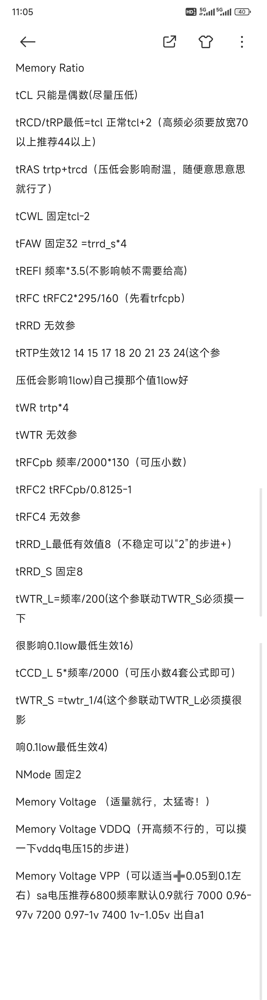
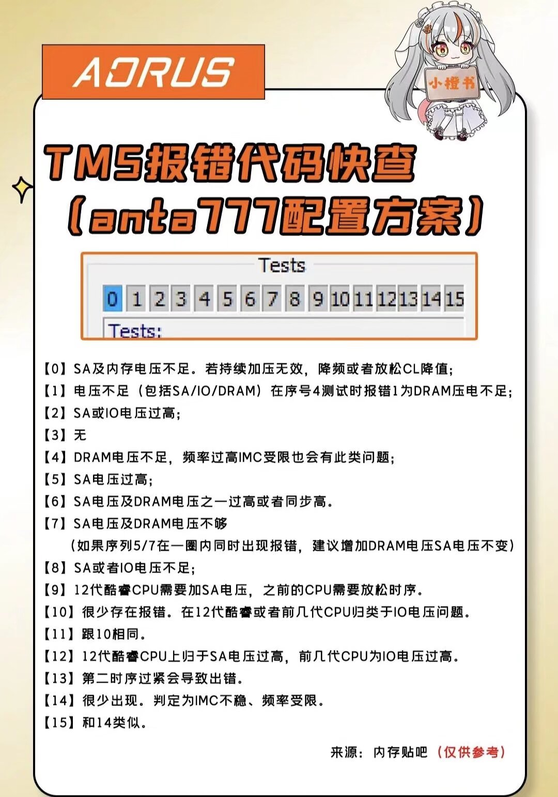
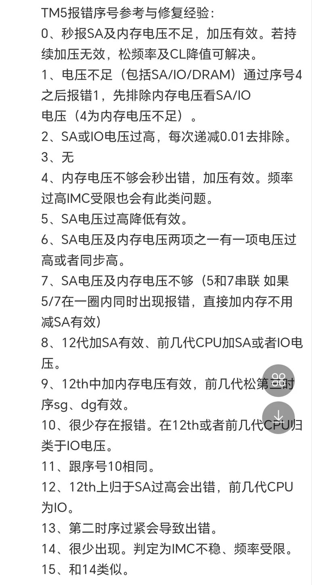

# DDR5 内存超频速查：时序公式 · AM5 设置 · TM5 报错排查

> **分类**：内存超频 · 时序调优
>
> **适用场景**：DDR5 内存（尤其海力士 A-die 颗粒）手动超频与收紧时序——时序公式推算、AM5 平台 BIOS 设置要点、TM5 稳定性测试报错排查。适用于 AM5 平台及支持内存时序调节的机型。
>
> 本文技术内容已对照 DDR5 领域公认规则及多家超频社区信源交叉验证，核查记录见文末。

---

## 背景

手动收紧内存时序（缩时序）是继频率之后进一步提升内存性能的手段。本篇速查分四部分：

1. **时序公式速查表**——按目标频率快速推算各参数起步值；
2. **进阶调优细则**——逐参数的有效值、优先级与经验细则；
3. **AM5 内存超频步骤**——BIOS 中的频率模式、电压与 FCLK 设置要点；
4. **TM5 报错序号参考**——压测报错后按序号定位原因。

> 📌 公式中的「目标频率」指内存等效频率（MT/s），如 DDR5-6000 即取 6000。

## 一、时序公式速查表（以 DDR5-6000 为例）

| 参数 | 公式 / 规则 | 示例值 @6000 | 备注 |
| --- | --- | --- | --- |
| tCL | 第一时序，越低越好，**只能为偶数** | 30 | DDR5 架构特性，CAS 只有偶数档 |
| tRCD / tRP | tCL + 2～4（最低 = tCL） | 32～34 | 高频需放宽：7000 以上推荐 ≥ 44 |
| tRAS | ≥ tCL + tRCD + 2～4 | ≥ 64～66 | 影响耐温 |
| tCWL | ≤ tCL，相差 0～2（可固定 tCL−2） | 28～30 | 写入延迟对齐 |
| tFAW | tRRD_S × 4（固定 32） | 32 | 四激活窗口规则 |
| tREFI | 目标频率 × 3.5 | 21000 | 对游戏帧率影响甚微，无需给高 |
| tRFC | 160 × 目标频率 / 2000 | 480 | 折合 160ns，A-die 公认甜点值 |
| tWR | 目标频率 / 400 × 4 | 60 | 不确定度较高，可参考进阶版 tRTP × 4 |
| tRFCpb | 130 × 目标频率 / 2000 | 390 | 折合 130ns，逐 bank 刷新，可压小数 |
| tRRD_L | ≈ 目标频率 / 400（最低生效 8） | 15 | 越低越好，不稳则以 +2 步进放宽 |
| tRRD_S | ≥ 8（固定 8） | 8 | A-die 颗粒的物理下限就是 8 |
| tWTR_L | 目标频率 / 200 | 30 | 与 tWTR_S 联动，影响 0.1% low |
| tWTR_S | tWTR_L / 4 | 8 | 与 tWTR_L 联动 |

## 二、进阶调优细则

| 参数 | 细则 |
| --- | --- |
| Memory Ratio | CPU 体质优先，CL 其次，频率最后 |
| tRCD / tRP | 最低 = tCL，正常 tCL + 2；高频必须放宽，7000 以上推荐 44 以上 |
| tRAS | = tRTP + tRCD；压低会影响耐温，取合理值即可 |
| tCWL | 固定 tCL − 2 |
| tRTP | 生效值仅 12 / 14 / 15 / 17 / 18 / 20 / 21 / 23 / 24 档位；压低影响 1% low，逐档自摸取 1% low 最优值 |
| tWR | = tRTP × 4 |
| tRFC | = tRFC2 × 295 / 160（先看 tRFCpb）；295/160 与 JEDEC 16Gb 颗粒 tRFC1/tRFC2（295ns/160ns）比值一致 |
| tRFC2 | = tRFCpb / 0.8125 − 1 |
| tRFCpb | = 频率 / 2000 × 130，可压小数 |
| tRRD / tWTR / tRFC4 | 部分平台上为无效参数（不生效） |
| tRRD_L | 最低生效值 8，不稳则以 +2 步进放宽 |
| tCCD_L | = 5 × 频率 / 2000，可压小数 |
| NMode | 固定 2 |
| 内存电压 | 适度即可，对帧率无感 |
| VDDQ | 高频上不去时可尝试微调摸索（图中标注「15 的步进」，推测为 0.015V） |
| VPP | 在 VDD 基础上 +0.05～0.1V |
| SA 电压（按频率） | 6800：默认 0.9V；7000：0.96～0.97V；7200：0.97～1.0V；7400：1.0～1.05V |

### 与基础版速查表的差异说明

| 项目 | 基础版 | 进阶版 | 说明 |
| --- | --- | --- | --- |
| tRAS | ≥ tCL + tRCD + 2～4 | = tRTP + tRCD | 前者为保守的教科书式下限；后者为社区实测的实际下限规则，与主流调优讨论一致，取值建议介于两者之间 |
| tWR | 频率 / 400 × 4 | tRTP × 4 | 两版公式不同，均属估算，可按主板 AUTO 值保守处理 |
| tWTR_L | 最低 30 | 最低生效值 16 | 30 为稳妥值，16 为平台生效下限，实际取值需逐档实测 |
| tWTR_S | 最低 8 | 最低生效值 4 | 同上 |

## 三、AM5 内存超频步骤要点（BIOS 设置）

1. 进入高级页：点击左上角红色箭头处；
2. 点击第二行箭头处进入 OC 设置；
3. **内存频率（Memory Ratio）**选择 AMD 超频模式：**8000↑ 即 1:2 模式、6400↓ 即 1:1 模式**；
4. **VDDIO**：1.3V（1.35V 亦属安全电压，但在部分游戏中可能造成显卡掉驱动）；
5. **SOC 电压**：固定 1.25V；
6. **VDDG**：0.95V（点击电压选项选择动态调整）；
7. **VDDP**：1.05V（直接锁住即可，SOCDID 需动态调整）；
8. **FCLK**：2000（FCLK 会随动态调整），UCLK = MEMCLK / 2 即 1:2 模式；
9. 将 **FCLK MODE** 切换至 as UI（异步）模式；
10. 设置内存时序与内存电压：**VDD 1.4V、VDDQ 1.3V**（时序与电压需按体质自摸）。

## 四、TM5 报错序号参考与修复经验

TM5（TestMem5）是社区最常用的内存稳定性测试工具（推荐配合 anta777 Extreme 等配置，跑 3~5 个循环）。报错界面会显示序号（如 `#4`、`#13`），可按下表定位原因：

| 序号 | 原因与修复经验 |
| --- | --- |
| 0 | 秒报多为 SA 及内存电压不足，加压有效；持续加压无效则松频率或降低 CL |
| 1 | 电压不足（含 SA / IO / DRAM）；若在通过序号 4 之后才报 1，先排除内存电压，再查 SA/IO（4 为内存电压不足） |
| 2 | SA 或 IO 电压过高，每次递减 0.01V 排除 |
| 3 | 无明确对应 |
| 4 | 内存电压不足会秒出错，加压有效；频率过高 IMC 受限也会有此类问题 |
| 5 | SA 电压过高，降低有效 |
| 6 | SA 电压与内存电压两项之一过高，或同步偏高 |
| 7 | SA 电压及内存电压不足；若 5/7 在同一循环内同时报错，直接加内存电压、不减 SA 即可有效 |
| 8 | 12 代加 SA 有效；前几代 CPU 加 SA 或 IO 电压 |
| 9 | 12 代加内存电压有效；前几代松第二时序 sg、dg 有效 |
| 10 | 很少报错；12 代及前几代 CPU 归类于 IO 电压 |
| 11 | 与序号 10 相同 |
| 12 | 12 代上多为 SA 过高出错；前几代 CPU 为 IO |
| 13 | 第二时序过紧导致出错 |
| 14 | 很少出现；判定为 IMC 不稳、频率受限 |
| 15 | 与 14 类似 |

> 注：序号 8/9/12 中「12 代」指 Intel 第 12 代酷睿（Alder Lake），「SA / IO」为 Intel 平台内存控制器相关电压（VCCSA / VCCIO）；AMD 平台可对应参考 SOC / VDDIO 电压排查思路。

## 使用建议

1. 先定频率和 tCL，再按公式推算其余参数作为**保守起步值**；
2. 每收紧一项参数后用 TM5 压测验证稳定性，报错则按上表定位回退该项；
3. 时序压得越紧，对内存颗粒体质、内存电压（VDD/VDDQ）和内存控制器（IMC）要求越高；笔记本平台散热与供电余量有限，建议小幅渐进；
4. 超频有风险：可能影响稳定性、硬件寿命及保修，数据请提前备份，后果自负。

---

## 事实核查记录

本文公式与经验已对照 DDR5 领域公认规则及多家超频社区信源核实，结论：**核心结构性规则与平台设置均属实；部分数值公式为社区经验估算，整体可靠，可作为起步参考**。

| 声明 | 核查结果 |
| --- | --- |
| tCL 只能为偶数 | ✅ 属实：DDR5 因 BL32 突发长度对齐，CAS Latency 只定义偶数档（DDR4 才有奇数 CL） |
| tRAS ≥ tCL + tRCD + 2~4 | ✅ 属实（经典保守规则）：教科书式下限；进阶版 tRAS = tRTP + tRCD 与现代社区认知的实际下限一致 |
| tCWL ≤ tCL，相差 0~2 | ✅ 属实：主流调优指南公认规则 |
| tFAW = tRRD_S × 4 | ✅ 属实：JEDEC 规则——tFAW（Four Activate Window）窗口内最多 4 次激活，故下限 = 4 × tRRD_S |
| tRRD_S ≥ 8，A-die 最低就是 8 | ✅ 属实：海力士 A-die 公认甜点值，社区大量实测佐证 |
| tRFC ≈ 160ns（160 × 频率 / 2000） | ✅ 属实：16Gb A-die 在 ~1.4V 下普遍可达 160ns 或更低，为公认甜点值 |
| tRFC 公式中的 295/160 比值 | ✅ 吻合：与 JEDEC 16Gb 颗粒 tRFC1 / tRFC2（295ns / 160ns）标准比值一致 |
| TM5 报错序号对照表 | ✅ 属实：与 Chiphell 论坛、CSDN 等广泛流传的社区标准版对照表一致；报错 13 对应时序过紧与社区共识相符 |
| AM5：≤6400 用 1:1、8000↑ 用 1:2 模式，FCLK 2000 | ✅ 属实：AM5 公认甜点配置，主流调优指南一致 |
| SOC 1.25V / VDDG 0.95V / VDDP 1.05V / VDDIO 1.3V | ✅ 属实：均落在社区典型区间（FCLK 2000 建议 VDDG ≈ 0.9V 以上；SOC 常见 1.2~1.3V，AMD 官方安全上限 1.3V） |
| tRFCpb ≈ 130ns | ⚠️ 估算值：「逐 bank 刷新时序短于全 bank 刷新」的原则正确，具体数值随颗粒与容量不同 |
| tREFI = 频率 × 3.5（不影响帧率） | ⚠️ 估算值：「tREFI 对游戏帧率影响甚微」与 Hardware Unboxed 等实测结论一致；结果属温和放宽的调优区间 |
| tRCD/tRP = tCL + 2~4 | ⚠️ 经验起步范围：偏激进一侧，好体质 A-die 可达，普通颗粒可放宽；高频（7000+）需 ≥ 44 的补充与社区经验一致 |
| tRRD_L ≈ 频率/400、tWTR_L = 频率/200、tWTR_S = tWTR_L/4、tCCD_L = 5×频率/2000 | ⚠️ 估算值：结果落在社区常见调优区间内，非硬性规则 |
| tRTP 生效档位（12/14/15/17/18/20/21/23/24） | ⚠️ 平台相关经验：部分 BIOS 对特定时序按离散档位生效，未找到独立文档佐证 |
| SA 电压按频率对照（0.9～1.05V） | ⚠️ 平台归属不明确：数值量级接近 AMD VDDP/VDDG 区间、低于 Intel VCCSA 常见值，按自身平台甄别使用 |
| VDDIO 1.35V 可能造成部分游戏显卡掉驱动 | ⚠️ 未找到独立佐证，属社区个案经验；1.35V 本身亦被标注为安全电压 |
| tWR 公式（频率/400×4 或 tRTP×4） | ❓ 两个版本均无独立佐证，建议按主板 AUTO 值保守处理 |

**参考来源：**

- [Reddit r/overclocking — AM5 DDR5 Tuning Cheat Sheet, observations and notes](https://www.reddit.com/r/overclocking/comments/1k3o7qe/am5_ddr5_tuning_cheat_sheet_observations_and_notes/)
- [overclock.net — AMD DDR5 OC and 24/7 Daily Memory Stability Thread](https://www.overclock.net/threads/amd-ddr5-oc-and-24-7-daily-memory-stability-thread.1800926/)
- [ocinside.de — AMD Ryzen 7000/9000 DDR5 RAM OC Guide](https://www.ocinside.de/workshop_en/amd_ryzen_7000_9000_ddr5_oc_guide/4/)
- [Skatterbencher — Raphael Overclocking](https://skatterbencher.com/2022/09/26/raphael-overclocking-whats-new/)
- [overclock.net — AMD Hynix DDR5 Overclocking Guide](https://www.overclock.net/threads/amd-hynix-ddr5-overclocking-guide.1801842/)
- [TechPowerUp — SK Hynix A-Die Overclocking Thread (AM5)](https://www.techpowerup.com/forums/threads/sk-hynix-a-die-overclocking-thread-only-for-ryzen-am5-users.335298/)
- [LinusTechTips — Help me tune my DDR5 timings (Hynix A-Die)](https://linustechtips.com/topic/1491776-help-me-tune-my-ddr5-timings-hynix-a-die/)
- [SystemVerilog.io — Understanding DDR4 timing parameters（tFAW 规则原理）](https://www.systemverilog.io/design/understanding-ddr4-timing-parameters/)
- [StackExchange — Origin of tFAW (Four Activation Window)](https://cs.stackexchange.com/questions/32286/origin-of-tfaw-four-activation-window-in-dram-timing-constraint)
- [Reddit r/overclocking — RAM timing rules（tRAS 实际约束讨论）](https://www.reddit.com/r/overclocking/comments/tsuttu/ram_timing_rules/)
- [Chiphell — TM5 报错序号参考与修复经验（社区流传版）](https://www.chiphell.com/thread-2558237-4-1.html)
- [CSDN — TM5 报错序号参考](https://blog.csdn.net/weixin_70708397/article/details/136529015)
- [NGA — TM5 5opt 报错序号都代表了什么](https://bbs.nga.cn/read.php?tid=35178611)
