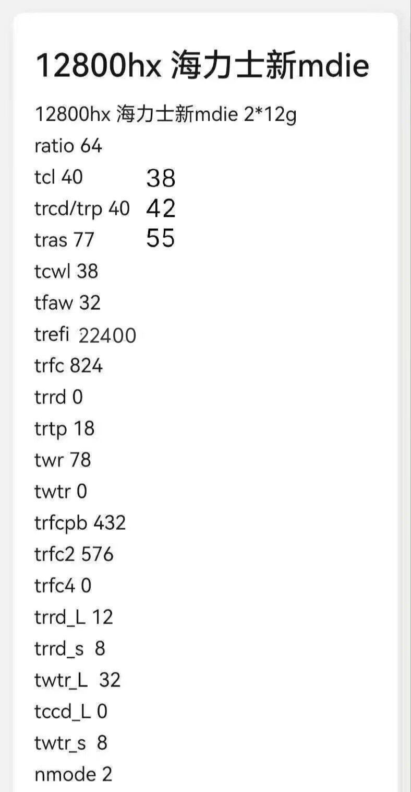
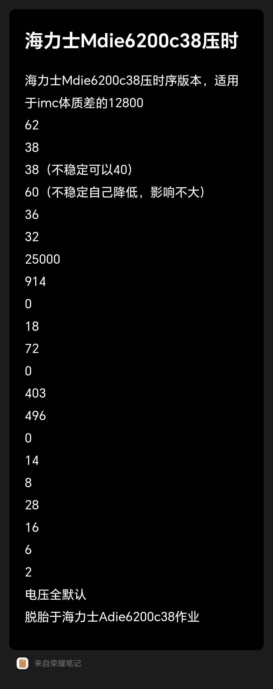

# i7-12800HX 海力士 M-die 超频参数

> **定位**：i7-12800HX（Alder Lake HX 移动端）+ 海力士**新 M-die** 2×12GB 双条平台的内存超频实机作业记录。
>
> 与 [DDR5 时序公式速查](./DDR5-内存超频时序参数公式速查.md) 的 A-die/AM5 内容**不可混用**：M-die 的 tRFC 系列值远高于 A-die，直接套用 A-die 作业会失败。
>
> ⚠️ 本文为个人/社区作业笔记整理（原始截图见文末），未经独立横向验证；两组数据的内部换算自洽性已核对，见[事实核查记录](#事实核查记录)。

## 阅读说明（重要）

- 第二节表格有**两列数值**：左列为基准作业，右列为收紧变体——**仅 tCL、tRCD/tRP、tRAS 三行数值改变（38 / 42 / 55），其余参数两列通用**；
- **tRCD 与 tRP 是同一个值**（同为 40，或收紧后同为 42），不是"tRCD=40、tRP=42"两个不同设置；
- `tRRD`、`tWTR`、`tRFC4` 三项写 0 表示交由平台默认/不生效，与 DDR5 速查页"无效参"的说法一致。

## 一、DDR5-6400 作业（Ratio 64）

| 参数 | 基准 | 收紧变体 |
| --- | ---: | ---: |
| Ratio | 64（DDR5-6400） | 不变 |
| tCL | 40 | **38** |
| tRCD / tRP | 40 | **42** |
| tRAS | 77 | **55** |
| tCWL | 38 | 不变 |
| tFAW | 32 | 不变 |
| tREFI | 22400 | 不变 |
| tRFC | 824 | 不变 |
| tRRD | 0 | 不变 |
| tRTP | 18 | 不变 |
| tWR | 78 | 不变 |
| tWTR | 0 | 不变 |
| tRFCpb | 432 | 不变 |
| tRFC2 | 576 | 不变 |
| tRFC4 | 0 | 不变 |
| tRRD_L | 12 | 不变 |
| tRRD_S | 8 | 不变 |
| tWTR_L | 32 | 不变 |
| tCCD_L | 0 | 不变 |
| tWTR_S | 8 | 不变 |
| NMode | 2 | 不变 |

> 变体的取舍逻辑：以放宽 tRCD/tRP（40→42）为代价，换取 tCL（40→38）与 tRAS（77→55）的收紧——典型的 CL 优先权衡。注意该表未包含电压部分（原始截图可能截断）。

## 二、DDR5-6200c38 稳妥版（IMC 体质差适用）

原资料注明：适用于 IMC 体质差的 i7-12800HX；**电压全默认**；作业脱胎于海力士 A-die 6200c38 方案。

| 参数 | 值 | 原资料备注 |
| --- | ---: | --- |
| Ratio | 62（DDR5-6200） | — |
| tCL | 38 | — |
| tRCD / tRP | 38 | 不稳定可以放宽到 40 |
| tRAS | 60 | 不稳定可自行降低，影响不大 |
| tCWL | 36 | — |
| tFAW | 32 | — |
| tREFI | 25000 | — |
| tRFC | 914 | — |
| tRRD | 0 | — |
| tRTP | 18 | — |
| tWR | 72 | — |
| tWTR | 0 | — |
| tRFCpb | 403 | — |
| tRFC2 | 496 | — |
| tRFC4 | 0 | — |
| tRRD_L | 14 | — |
| tRRD_S | 8 | — |
| tWTR_L | 28 | — |
| tCCD_L | 16 | — |
| tWTR_S | 6 | — |
| NMode | 2 | — |

## 三、换算自洽性对照

按公式 `ns = 周期数 ÷ 频率(MT/s) × 2000` 换算，两组作业的刷新系参数高度自洽：

| 参数 | 6400 组 | 折合 | 6200 组 | 折合 | 说明 |
| --- | ---: | ---: | ---: | ---: | --- |
| tRFC | 824 | ≈258ns | 914 | ≈295ns | M-die 全 bank 刷新典型区间，显著高于 A-die 的 ~480 |
| tRFCpb | 432 | ≈135ns | 403 | ≈130ns | 与「逐 bank 刷新 ≈130ns」经验规则吻合 |
| tRFC2 | 576 | ≈180ns | 496 | ≈160ns | 与 tRFC2 ≈160ns 的通行比值吻合 |

## 四、使用注意

1. M-die 与 A-die 参数体系差异最大的就是 tRFC 系列，切勿把 A-die 的 480~500 直接抄进 M-die；
2. 两张作业表都未给出 SA/IO/VDDQ 等电压细节（6200 版注明电压全默认），复现时建议其余电压保持默认并逐项小步摸索；
3. 双条 2×12GB 为非对称容量配置，兼容性窗口比对称双通道更窄，报错时优先放宽 tRCD/tRP 与 tRAS。

## 原始资料截图

## 事实核查记录

核验基准：原始笔记截图（来自荣耀笔记 App）+ 内部换算自洽性检验（2026-08-21）。

| 声明 | 核查结果 |
| --- | --- |
| 两组作业的 tRFC/tRFC2/tRFCpb 按 ns 换算后内部自洽 | ✅ 属实：tRFCpb≈130ns、tRFC2≈160ns 与通行规则吻合，tRFC≈258/295ns 符合 M-die 颗粒特性 |
| M-die 与 A-die 参数不可混用 | ✅ 属实：两者 tRFC 相差近一倍（824~914 vs ~480），直接套用必然失败 |
| 变体列仅改 tCL/tRCD·tRP/tRAS 三行（38/42/55） | ✅ 已按提供者说明写入正文阅读说明 |
| tRCD 与 tRP 为同一值 | ✅ 已按提供者说明写入正文阅读说明 |
| 各项参数的绝对有效性 | ⚠️ 个人作业记录，未经独立横向验证；仅代表该台 12800HX + 新 M-die 2×12G 平台的可行解 |
| 图 2 是否包含电压信息 | ⚠️ 可见部分无电压条目（可能截断）；图 1 标注电压全默认 |
EOF
echo OK